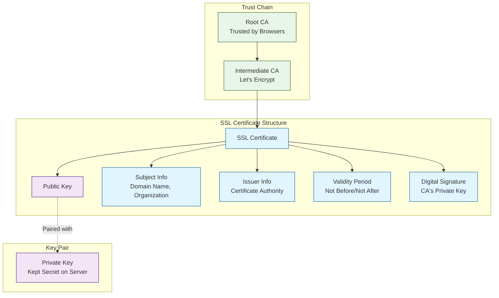
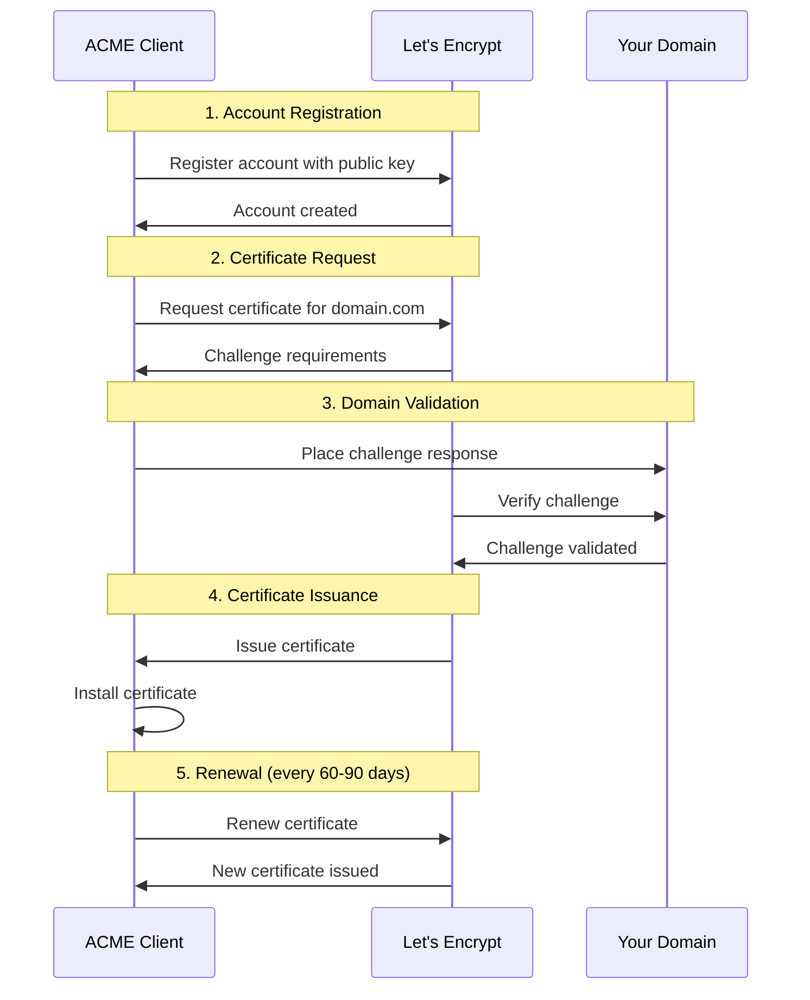
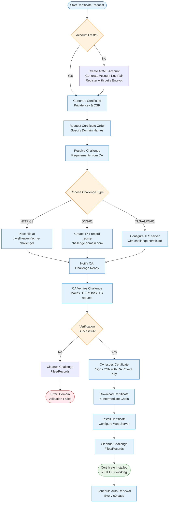

# SSL/TLS Certificates & ACME Protocol Complete Guide

## Table of Contents
- [SSL/TLS Fundamentals](#ssltls-fundamentals)
- [Let's Encrypt & ACME Overview](#lets-encrypt--acme-overview)
- [ACME Challenge Methods](#acme-challenge-methods)
- [Certificate Request Methods](#certificate-request-methods)
- [Certificate Issuance Process](#certificate-issuance-process)
- [Real-World Examples](#real-world-examples)
- [Best Practices & Troubleshooting](#best-practices--troubleshooting)
- [References](#references)

---

## SSL/TLS Fundamentals

### What is SSL/TLS?

**SSL (Secure Sockets Layer)** and **TLS (Transport Layer Security)** are cryptographic protocols that provide secure communication over networks. TLS is the modern successor to SSL, though the terms are often used interchangeably.

### Why Certificates Matter

SSL/TLS certificates serve three critical purposes:

1. **Encryption**: Protects data in transit between client and server
2. **Authentication**: Verifies the identity of the server
3. **Integrity**: Ensures data hasn't been tampered with during transmission

### Certificate Components



---

## Let's Encrypt & ACME Overview

### What is Let's Encrypt?

**Let's Encrypt** is a free, automated, and open Certificate Authority (CA) that provides SSL/TLS certificates to enable HTTPS on websites. Key features:

- **Free**: No cost for certificates
- **Automated**: Certificates can be obtained and renewed automatically
- **Open**: Transparent operations and open-source tools
- **Short-lived**: 90-day validity to encourage automation

### What is ACME?

**ACME (Automatic Certificate Management Environment)** is the protocol used by Let's Encrypt to automate certificate issuance and management. It's defined in RFC 8555.

#### ACME Benefits:
- **Automation**: No manual intervention required
- **Domain Validation**: Proves you control the domain
- **Standardized**: Works with multiple CAs
- **Secure**: Cryptographic verification process

#### ACME Workflow Overview:



---

## ACME Challenge Methods

ACME uses challenges to verify that you control the domain(s) for which you're requesting a certificate. There are three types of challenges:

### 1. HTTP-01 Challenge

**How it works:**
- ACME client places a file at `http://yourdomain.com/.well-known/acme-challenge/token`
- Let's Encrypt makes an HTTP request to verify the file
- File contains the token + account key thumbprint

**Use Cases:**
- Web servers with HTTP access
- Simple domain validation
- Most common method

**Advantages:**
✅ Simple to implement  
✅ Works with most web servers  
✅ No DNS configuration needed  

**Limitations:**
❌ Requires port 80 access  
❌ Cannot be used for wildcard certificates  
❌ Domain must be publicly accessible  

**Example Challenge File:**
```bash
# File location: /.well-known/acme-challenge/gfj9Xq...Rg85nM
# File content:
gfj9Xq...Rg85nM.9jg46WB3rR7AHwvzMfx...28DjVTABr4r2HkuS
```

### 2. DNS-01 Challenge

**How it works:**
- ACME client creates a TXT record: `_acme-challenge.yourdomain.com`
- Let's Encrypt queries DNS to verify the record
- Record contains a hash of the token + account key

**Use Cases:**
- Wildcard certificates (*.example.com)
- Internal/private domains
- When HTTP access is not available
- Automated DNS providers

**Advantages:**
✅ Works for wildcard certificates  
✅ No need for public HTTP access  
✅ Works with internal domains  
✅ More secure (no web server required)  

**Limitations:**
❌ Requires DNS API or manual intervention  
❌ More complex setup  
❌ DNS propagation delays  

**Example DNS Record:**
```bash
# DNS TXT Record
_acme-challenge.example.com. 300 IN TXT "gfj9Xq...hash...28DjVTABr4r2HkuS"
```

### 3. TLS-ALPN-01 Challenge

**How it works:**
- ACME client configures TLS server with special certificate
- Let's Encrypt connects on port 443 with ALPN extension
- Verifies the special certificate contains the challenge

**Use Cases:**
- When port 80 is not available
- Pure TLS environments
- Advanced setups

**Advantages:**
✅ Works when only port 443 is available  
✅ No HTTP server needed  
✅ Fast validation  

**Limitations:**
❌ Complex implementation  
❌ Limited client support  
❌ Cannot be used for wildcard certificates  

### Challenge Comparison

| Challenge | Port Required | Wildcard Support | Complexity | Best For |
|-----------|---------------|------------------|------------|----------|
| HTTP-01 | 80 | ❌ | Low | Standard web servers |
| DNS-01 | None | ✅ | Medium | Wildcards, internal domains |
| TLS-ALPN-01 | 443 | ❌ | High | Port 80 blocked scenarios |

---

## Certificate Request Methods

### 1. Webroot Method

**Description:** Places challenge files in existing web server's document root.

**When to use:**
- Web server is already running
- You have write access to web root
- Don't want to stop the web server

**Example:**
```bash
# Apache/Nginx running, place files in web root
certbot certonly --webroot -w /var/www/html -d example.com -d www.example.com
```

**Pros:** ✅ No downtime ✅ Works with existing servers  
**Cons:** ❌ Requires web server ❌ Need write access to web root

### 2. Standalone Method

**Description:** Runs temporary web server on port 80 for challenge.

**When to use:**
- No web server running
- Can bind to port 80 temporarily
- Simple validation needed

**Example:**
```bash
# Stop existing web server first
sudo systemctl stop nginx
certbot certonly --standalone -d example.com
sudo systemctl start nginx
```

**Pros:** ✅ Simple setup ✅ No web server needed  
**Cons:** ❌ Requires downtime ❌ Must stop existing servers

### 3. DNS-based Method

**Description:** Uses DNS TXT records for domain validation.

**When to use:**
- Wildcard certificates needed
- Domain not publicly accessible
- Automated DNS provider available

**Example:**
```bash
# Manual DNS method
certbot certonly --manual --preferred-challenges dns -d example.com -d *.example.com

# With DNS plugin (Cloudflare example)
certbot certonly --dns-cloudflare --dns-cloudflare-credentials cloudflare.ini -d example.com
```

**Pros:** ✅ Wildcard support ✅ No HTTP required  
**Cons:** ❌ DNS configuration needed ❌ Propagation delays

### 4. Reverse Proxy Method

**Description:** Configure reverse proxy to handle ACME challenges.

**When to use:**
- Load balancer in front of servers
- Multiple backend servers
- Complex infrastructure

**Nginx Configuration Example:**
```nginx
server {
    listen 80;
    server_name example.com;
    
    # ACME challenge location
    location /.well-known/acme-challenge/ {
        root /var/www/certbot;
    }
    
    # Redirect other traffic to HTTPS
    location / {
        return 301 https://$server_name$request_uri;
    }
}
```

---

## Certificate Issuance Process

### Key Components

#### 1. Account Key
- **Purpose:** Identifies your ACME account with Let's Encrypt
- **Type:** RSA 2048-bit or ECDSA P-256 key pair
- **Storage:** Securely stored by ACME client
- **Usage:** Signs all requests to Let's Encrypt

#### 2. Certificate Private Key
- **Purpose:** Used for SSL/TLS encryption on your server
- **Type:** RSA 2048/4096-bit or ECDSA P-256/P-384 key pair
- **Storage:** Must be kept secret on your server
- **Usage:** Decrypts data encrypted with certificate's public key

### Detailed ACME Flow



### Step-by-Step Process

1. **Account Registration** (First time only)
   ```bash
   # Generate account key
   openssl genrsa -out account.key 4096
   
   # Register with Let's Encrypt
   certbot register --email your-email@example.com --agree-tos
   ```

2. **Generate Certificate Private Key & CSR**
   ```bash
   # Generate private key
   openssl genrsa -out example.com.key 4096
   
   # Generate Certificate Signing Request
   openssl req -new -key example.com.key -out example.com.csr
   ```

3. **Domain Validation**
   - ACME client places challenge response
   - Let's Encrypt verifies you control the domain
   - Validation must succeed for all requested domains

4. **Certificate Issuance**
   - Let's Encrypt signs your CSR
   - Returns certificate + intermediate chain
   - Certificate valid for 90 days

5. **Installation & Renewal**
   - Install certificate on web server
   - Configure automatic renewal (every 60 days)

---

## Real-World Examples

### Example 1: Linux Web Server with Certbot

This example shows how to obtain and install an SSL certificate for a Linux web server running Nginx.

#### Prerequisites:
- Ubuntu/Debian server with Nginx installed
- Domain pointing to your server's IP
- Port 80 and 443 accessible from internet

#### Step 1: Install Certbot
```bash
# Update package manager
sudo apt update

# Install Certbot and Nginx plugin
sudo apt install certbot python3-certbot-nginx

# Verify installation
certbot --version
```

#### Step 2: Configure Nginx (Basic Setup)
```bash
# Create basic Nginx configuration
sudo nano /etc/nginx/sites-available/example.com
```

```nginx
server {
    listen 80;
    server_name example.com www.example.com;
    
    root /var/www/example.com;
    index index.html;
    
    location / {
        try_files $uri $uri/ =404;
    }
    
    # Location for ACME challenges
    location /.well-known/acme-challenge/ {
        root /var/www/example.com;
    }
}
```

```bash
# Enable the site
sudo ln -s /etc/nginx/sites-available/example.com /etc/nginx/sites-enabled/
sudo nginx -t  # Test configuration
sudo systemctl reload nginx
```

#### Step 3: Obtain Certificate (Automatic Method)
```bash
# Automatic certificate installation with Nginx plugin
sudo certbot --nginx -d example.com -d www.example.com

# During interactive setup:
# - Enter email address
# - Agree to terms of service
# - Choose whether to share email with EFF
# - Select redirect option (recommended: redirect HTTP to HTTPS)
```

#### Step 4: Verify Installation
```bash
# Check certificate details
sudo certbot certificates

# Test HTTPS
curl -I https://example.com

# Check SSL Labs rating
# Visit: https://www.ssllabs.com/ssltest/analyze.html?d=example.com
```

#### Step 5: Test Automatic Renewal
```bash
# Dry run renewal test
sudo certbot renew --dry-run

# Check renewal timer
sudo systemctl status certbot.timer

# Manual renewal (if needed)
sudo certbot renew
```

#### Final Nginx Configuration (After Certbot):
```nginx
server {
    listen 80;
    server_name example.com www.example.com;
    return 301 https://$server_name$request_uri;
}

server {
    listen 443 ssl http2;
    server_name example.com www.example.com;
    
    # SSL Configuration added by Certbot
    ssl_certificate /etc/letsencrypt/live/example.com/fullchain.pem;
    ssl_certificate_key /etc/letsencrypt/live/example.com/privkey.pem;
    include /etc/letsencrypt/options-ssl-nginx.conf;
    ssl_dhparam /etc/letsencrypt/ssl-dhparams.pem;
    
    root /var/www/example.com;
    index index.html;
    
    location / {
        try_files $uri $uri/ =404;
    }
}
```

### Example 2: pfSense Firewall Certificate

This example shows how to obtain and install an SSL certificate for pfSense using the ACME package.

#### Prerequisites:
- pfSense firewall with internet access
- Domain name pointing to pfSense WAN IP
- Port 80 accessible from internet (temporarily)

#### Step 1: Install ACME Package
1. **Access pfSense Web Interface**
   - Navigate to `https://your-pfsense-ip`
   - Login with admin credentials

2. **Install ACME Package**
   - Go to `System → Package Manager`
   - Click `Available Packages`
   - Search for "acme"
   - Click `Install` next to "acme" package
   - Wait for installation to complete

#### Step 2: Configure ACME Account
1. **Navigate to ACME Settings**
   - Go to `Services → Acme Certificates`
   - Click `Account keys` tab
   - Click `Add` to create new account

2. **Create Account Key**
   ```
   Name: LetsEncrypt-Production
   Description: Let's Encrypt Production Account
   Email: your-email@example.com
   ACME Server: Let's Encrypt Production ACME v2
   ```
   - Click `Create new account key`
   - Click `Register ACME account key`

#### Step 3: Configure Certificate
1. **Add New Certificate**
   - Go to `Certificates` tab
   - Click `Add` to create new certificate

2. **Certificate Configuration**
   ```
   Name: pfsense-web-cert
   Description: pfSense Web Interface Certificate
   Status: Active
   Acme Account: LetsEncrypt-Production
   Private Key: RSA 4096
   Domain SAN list:
     - Method: HTTP-01
     - Domain: firewall.example.com
     - Mode: Enabled
   ```

3. **HTTP-01 Challenge Configuration**
   ```
   Webroot local folder: /tmp
   Standalone HTTP port: 80
   Standalone HTTPS port: 443
   ```

#### Step 4: Domain Validation Setup
1. **Firewall Rule (Temporary)**
   - Go to `Firewall → Rules → WAN`
   - Add rule to allow HTTP traffic on port 80:
     ```
     Action: Pass
     Interface: WAN
     Protocol: TCP
     Source: Any
     Destination: WAN address
     Destination Port: 80 (HTTP)
     Description: Temporary - ACME HTTP-01 Challenge
     ```

2. **Issue Certificate**
   - Return to `Services → Acme Certificates → Certificates`
   - Click `Issue/Renew` next to your certificate
   - Monitor the process in the log output

#### Step 5: Install Certificate
1. **Import to Certificate Manager**
   - After successful issuance, go to `System → Cert. Manager → Certificates`
   - The ACME certificate should appear automatically

2. **Configure Web Interface**
   - Go to `System → Advanced → Admin Access`
   - SSL/TLS Certificate: Select your new ACME certificate
   - Save changes and reboot pfSense

#### Step 6: Cleanup and Automation
1. **Remove Temporary Firewall Rule**
   - Delete the temporary HTTP rule from WAN interface

2. **Configure Automatic Renewal**
   - The ACME package automatically configures renewal
   - Certificates will renew when they have 30 days or less remaining
   - Check `Status → System Logs → System` for renewal logs

#### Verification:
```bash
# Test from external machine
curl -I https://firewall.example.com

# Check certificate in browser
# Should show valid Let's Encrypt certificate
```

---

## Best Practices & Troubleshooting

### Security Best Practices

#### 1. Key Management
```bash
# Generate strong private keys
openssl genrsa -out example.com.key 4096  # RSA 4096-bit
# OR
openssl ecparam -genkey -name prime256v1 -out example.com.key  # ECDSA P-256

# Set proper permissions
chmod 600 /etc/ssl/private/example.com.key
chown root:root /etc/ssl/private/example.com.key
```

#### 2. Certificate Storage
- **Private keys**: Store in `/etc/ssl/private/` with 600 permissions
- **Certificates**: Store in `/etc/ssl/certs/` with 644 permissions
- **Backups**: Encrypt backups of private keys
- **Rotation**: Implement key rotation policies

#### 3. Web Server Security Headers
```nginx
# Nginx security headers
add_header Strict-Transport-Security "max-age=31536000; includeSubDomains; preload" always;
add_header X-Content-Type-Options "nosniff" always;
add_header X-Frame-Options "DENY" always;
add_header X-XSS-Protection "1; mode=block" always;
add_header Referrer-Policy "strict-origin-when-cross-origin" always;
```

### Monitoring & Maintenance

#### 1. Certificate Expiration Monitoring
```bash
# Check certificate expiration
openssl x509 -in /etc/ssl/certs/example.com.crt -noout -dates

# Automated monitoring script
#!/bin/bash
DOMAIN="example.com"
EXPIRY_DATE=$(echo | openssl s_client -servername $DOMAIN -connect $DOMAIN:443 2>/dev/null | openssl x509 -noout -dates | grep 'notAfter' | cut -d'=' -f2)
EXPIRY_EPOCH=$(date -d "$EXPIRY_DATE" +%s)
CURRENT_EPOCH=$(date +%s)
DAYS_LEFT=$(( (EXPIRY_EPOCH - CURRENT_EPOCH) / 86400 ))

if [ $DAYS_LEFT -lt 30 ]; then
    echo "Certificate expires in $DAYS_LEFT days!"
fi
```

#### 2. Renewal Automation
```bash
# Systemd timer for renewal (Ubuntu/Debian)
sudo systemctl enable certbot.timer
sudo systemctl start certbot.timer

# Check timer status
sudo systemctl list-timers certbot.timer

# Cron job alternative
0 0,12 * * * root python3 -c 'import random; import time; time.sleep(random.random() * 3600)' && certbot renew --quiet
```

### Common Issues & Solutions

#### Issue 1: Rate Limiting
**Problem:** Let's Encrypt has rate limits (20 certificates per domain per week)

**Solution:**
- Use staging environment for testing
- Plan certificate requests carefully
- Consider using fewer subdomains

```bash
# Use staging environment for testing
certbot certonly --staging -d example.com
```

#### Issue 2: DNS Propagation Delays
**Problem:** DNS-01 challenges fail due to slow DNS propagation

**Solution:**
- Wait longer for DNS propagation (up to 48 hours)
- Use DNS providers with faster propagation
- Check DNS propagation with tools

```bash
# Check DNS propagation
dig TXT _acme-challenge.example.com @8.8.8.8
nslookup -type=TXT _acme-challenge.example.com 1.1.1.1
```

#### Issue 3: Firewall Blocking
**Problem:** HTTP-01 challenges fail due to firewall rules

**Solution:**
- Ensure port 80 is accessible from internet
- Check for proxy/CDN interference
- Verify domain points to correct IP

```bash
# Test port accessibility
telnet your-domain.com 80
curl -I http://your-domain.com/.well-known/acme-challenge/test
```

#### Issue 4: Mixed Content Errors
**Problem:** HTTPS site loads HTTP resources, causing browser warnings

**Solution:**
- Update all resource URLs to HTTPS
- Use protocol-relative URLs
- Implement Content Security Policy

```html
<!-- Update resource URLs -->
<script src="https://example.com/script.js"></script>

<!-- Protocol-relative URLs -->
<script src="//example.com/script.js"></script>
```

### Performance Optimization

#### 1. OCSP Stapling
```nginx
# Nginx OCSP stapling
ssl_stapling on;
ssl_stapling_verify on;
ssl_trusted_certificate /etc/letsencrypt/live/example.com/chain.pem;
resolver 8.8.8.8 8.8.4.4 valid=300s;
resolver_timeout 5s;
```

#### 2. Session Resumption
```nginx
# SSL session optimization
ssl_session_cache shared:SSL:10m;
ssl_session_timeout 10m;
ssl_session_tickets off;  # Privacy-focused
```

#### 3. Certificate Chain Optimization
```bash
# Verify certificate chain
openssl s_client -connect example.com:443 -showcerts

# Check chain completeness
curl --head https://example.com
```

### Troubleshooting Commands

```bash
# Debug ACME client
certbot certonly --dry-run --debug-challenges -d example.com

# Check certificate details
openssl x509 -in certificate.crt -text -noout

# Verify certificate chain
openssl verify -CAfile chain.pem certificate.crt

# Test SSL configuration
openssl s_client -connect example.com:443 -servername example.com

# Check Let's Encrypt logs
tail -f /var/log/letsencrypt/letsencrypt.log
```

---

## References

### Official Documentation
1. [Let's Encrypt Documentation](https://letsencrypt.org/docs/)
2. [RFC 8555 - ACME Protocol](https://tools.ietf.org/html/rfc8555)
3. [Certbot Documentation](https://certbot.eff.org/docs/)

### Additional Resources
4. [Mozilla SSL Configuration Generator](https://ssl-config.mozilla.org/)
5. [SSL Labs Server Test](https://www.ssllabs.com/ssltest/)
6. [Certificate Transparency Logs](https://crt.sh/)

### Video Tutorials
7. [pfSense ACME Setup](https://youtu.be/pJsNHPJDugI)

### Tools & Utilities
- **Certbot**: Official ACME client
- **acme.sh**: Lightweight ACME client
- **Caddy**: Web server with automatic HTTPS
- **Traefik**: Reverse proxy with automatic certificates

---

*Last updated: May 2025*
*This guide covers ACME protocol v2 and current Let's Encrypt practices* 