# pfsense

1. Install ISO Image [here](https://atxfiles.netgate.com/mirror/downloads/) 
2. Need to have 2 network devices on proxmox
   1. By default vmbr0 is created
3. Now on the proxmox server, create 2 network bridges:
   - `vmbr0` for WAN which is already created by promox
   - `vmbr1` for LAN -> create this and do not atach any physical device to it
4. Sources:
   1. [1](https://www.youtube.com/watch?v=ZnT29rP-11s)
   2. [2](https://www.youtube.com/watch?v=RpCjlyvOt18)
5. In the setting Choose option 2 to set ip address for wan and lan
   1. For wan choose the ip address assigned by the router and also provide a gateway
   2. For lan choose ip address like `10.10.10.1` but do not enter any gateway and enable DHCP server on lan interface
   3. Once done, attach any other VM and add network driver i.e vmbr1 with has pfsens lan
   4. Now in this VM open browser with `10.10.10.1` and pfsense web interface will open
   5. Login with default credentials:
      - Username: `admin`
      - Password: `pfsense`
6. In pfsense the default gateway should be the one which WAN uses
7. The network traffic moves from LAN to WAN and to router and then internet

## Setup Summary

Absolutely! Here's a **complete summary** of all the key points we covered during your pfSense setup journey, especially tailored for your **NUC + Proxmox + pfSense + Captive Portal** configuration:

---

## 🔧 **Your Setup Overview**

* **Proxmox Server** running on a **NUC** with:

  * 1 built-in Ethernet port
  * 1 Wi-Fi interface (unused for now)
* Created a **pfSense VM** with:

  * `vmbr0` (connected to `eno1`) as **WAN**
  * `vmbr1` (no physical NIC) as **LAN**
* Windows VM attached to both `vmbr0` and `vmbr1` for testing

---

## 🛜 **Networking Design**

```mermaid
graph TB
    Internet[🌐 Internet]
    Router[🏠 Router<br/>192.168.0.1]
    
    subgraph "Proxmox Host - NUC"
        Physical[eno1 Physical NIC]
        vmbr0[vmbr0 Bridge<br/>Connected to eno1]
        vmbr1[vmbr1 Bridge<br/>Internal Only]
        
        subgraph "pfSense VM"
            WAN[WAN Interface<br/>vmbr0<br/>192.168.0.102]
            pfSense[pfSense Router<br/>NAT + Firewall<br/>DHCP Server]
            LAN[LAN Interface<br/>vmbr1<br/>10.10.10.1]
        end
        
        subgraph "Client VMs"
            WindowsVM[Windows VM<br/>10.10.10.x]
            UbuntuVM[Ubuntu Server<br/>10.10.10.x]
            OtherVMs[Other VMs<br/>10.10.10.x]
        end
    end
    
    WiFiAP[📶 Wi-Fi Access Point<br/>Connected to LAN]
    
    %% Physical Connections
    Internet --> Router
    Router --> Physical
    Physical --> vmbr0
    vmbr0 --> WAN
    
    %% pfSense Internal
    WAN --> pfSense
    pfSense --> LAN
    
    %% LAN Connections
    LAN --> vmbr1
    vmbr1 --> WindowsVM
    vmbr1 --> UbuntuVM
    vmbr1 --> OtherVMs
    vmbr1 --> WiFiAP
    
    %% Traffic Flow (Outbound)
    WindowsVM -.->|1. Request| LAN
    LAN -.->|2. NAT + Firewall| pfSense
    pfSense -.->|3. Route| WAN
    WAN -.->|4. Forward| Router
    Router -.->|5. Internet| Internet
    
    %% Styling
    classDef internet fill:#ff6b6b,stroke:#d63031,color:#fff
    classDef router fill:#fdcb6e,stroke:#e17055,color:#000
    classDef pfsense fill:#00b894,stroke:#00a085,color:#fff
    classDef vm fill:#74b9ff,stroke:#0984e3,color:#fff
    classDef bridge fill:#a29bfe,stroke:#6c5ce7,color:#fff
    classDef physical fill:#fd79a8,stroke:#e84393,color:#fff
    
    class Internet internet
    class Router router
    class pfSense pfsense
    class WindowsVM,UbuntuVM,OtherVMs vm
    class vmbr0,vmbr1 bridge
    class Physical,WAN,LAN physical
```

---

## ⚙️ **Configuration Details**

### pfSense Interfaces:

* **WAN**: `vmbr0`, static IP from router (e.g., `192.168.0.102`), gateway: `192.168.0.1`
* **LAN**: `vmbr1`, static IP: `10.10.10.1`, no gateway
* DHCP Server enabled on LAN (`10.10.10.100` range)

### DNS:

* DNS Resolver enabled on pfSense
* LAN clients use `10.10.10.1` as DNS server
* DNS lookup on pfSense works, but needed to fix DNS rules for clients

---

## 🌐 **Captive Portal Setup**

* Enabled on **LAN interface**
* DHCP must be working on LAN
* Clients redirected to portal page on first web request
* Captive Portal breaks internet if:

  * DNS or HTTP(S) not allowed in firewall
  * Portal page misconfigured
* Fix: Add LAN firewall rules allowing ports 53 (DNS), 80 (HTTP), and 443 (HTTPS)

---

## 💻 **Windows VM Notes**

* Has two NICs (WAN and LAN)
* Windows uses the NIC with **default gateway** for internet (usually WAN NIC)
* Disable default gateway on WAN NIC to force Windows to use LAN (via pfSense)

---